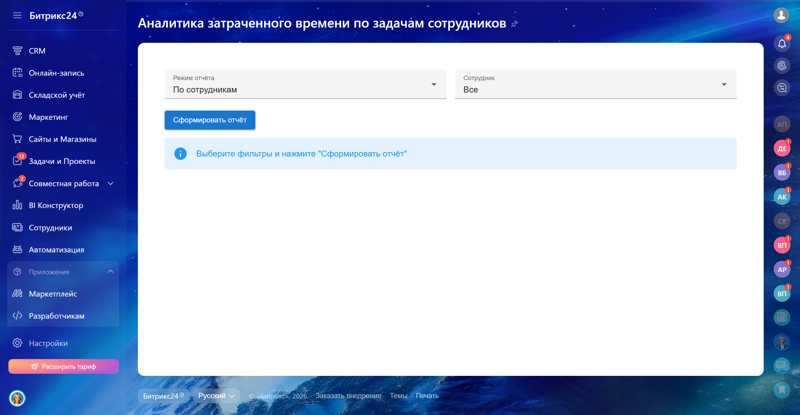
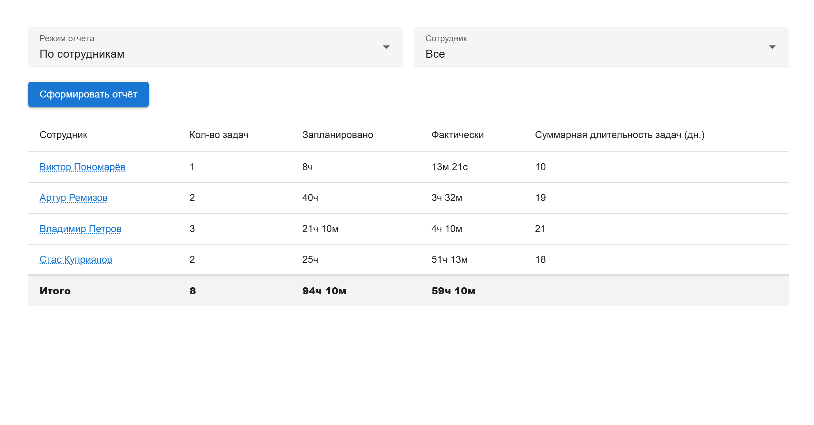
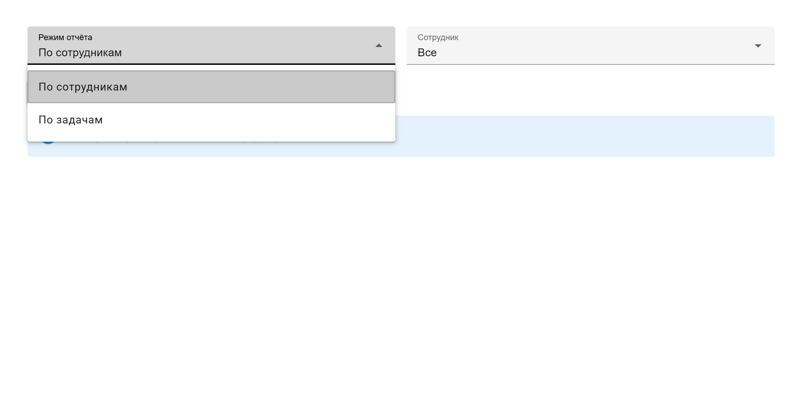
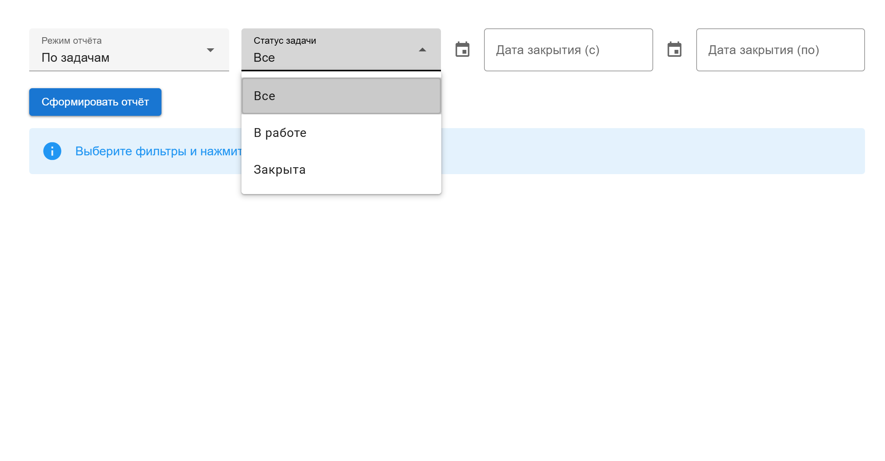
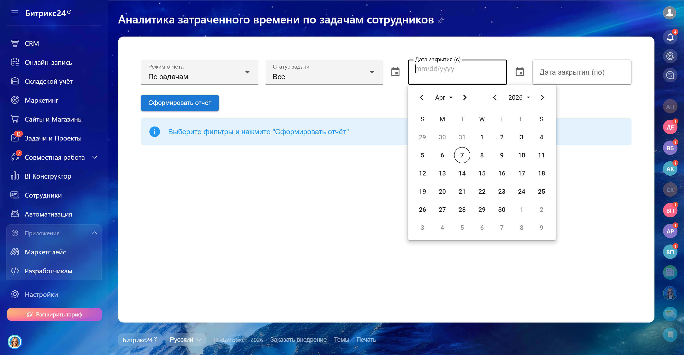

<h1>Контроль трудозатрат и загрузки команды ⏱️</h1>

Инструмент для автоматизации контроля трудозатрат сотрудников и анализа загрузки команды в <b>Bitrix24</b>. 
Помогает видеть отклонения от плановых задач и оперативно реагировать на перерасход времени.

<h2>🔹 Демонстрация работы приложения</h2>

<table width="600px" cellSpacing="1" cellpadding="1" border="1">
<tr><td></td></tr>
</table>
  

<!-- СЕТКА С КАРТИНКАМИ -->
<table>
<tr>
<td align="center">
 
<em>Начальный экран</em>
</td>

<td align="center">
 
<em>Вывод данных</em>
</td>
</tr>

<tr>

<td align="center">
 
<em>Выбор режима просмотра отчёта</em>
</td>

<td align="center">
 
<em>Фильтрация по конкретному сотруднику</em>
</td>
</tr>

<tr>

<td align="center">
 
<em>Фильтрация по статусу задачи</em>
</td>

<td align="center">
 
<em>Фильтрация по датам</em>
</td>
</tr>

<tr>

<td align="center">
 
<em>Индикация перерасхода времени</em>
</td>
</tr>
</table>

<h2>🔹 Проблема</h2>

Клиент столкнулся с необходимостью:

<ul>
<li>Удобно отслеживать времязатраты на задачи в команде</li>
<li>Контролировать перерасход времени и вовремя реагировать на отклонения от плана</li>
</ul>

<h2>🔹 Решение</h2>

Разработал приложение, которое позволяет:

<ul>
<li>Получать прозрачную картину загрузки сотрудников</li>
<li>Сравнивать плановые и фактические трудозатраты</li>
<li>Сразу подсвечивать перерасход и проблемные задачи</li>
<li>Создавать отчёты в двух режимах:
  <ul>
    <li><b>По сотруднику</b> – одна строка = один сотрудник</li>
    <li><b>По задаче</b> – одна строка = одна задача</li>
  </ul>
</li>
</ul>

<h2>🔹 Показатели отчета</h2>

<table>
<tr>
<th>Показатель</th>
<th>Описание</th>
</tr>
<tr>
<td>Сотрудник</td>
<td>ФИО сотрудника</td>
</tr>
<tr>
<td>Кол-во задач</td>
<td>Количество задач за период</td>
</tr>
<tr>
<td>Запланировано</td>
<td>Запланированное время</td>
</tr>
<tr>
<td>Затрачено</td>
<td>Фактическое время</td>
</tr>
<tr>
<td>Дней на задачу</td>
<td>Срок выполнения</td>
</tr>
</table>

<b>Итоги:</b>

<ul>
<li>Всего времени: Запланировано / Затрачено</li>
<li>Количество задач</li>
</ul>

<b>Фильтры:</b>

<ul>
<li>Сотрудник</li>
<li>Статус задачи</li>
<li>Период</li>
</ul>

<h2>🔹 Использованные технологии</h2>

<ul>
<li><b>Frontend:</b> Vue + Vuetify, JavaScript, Sass, Vite</li>
<li><b>Интеграция:</b> Bitrix24 API</li>
<li><b>Было выделено времени:</b> 7 дней</li>
<li><b>Время разработки:</b> 5 дней разработка + 2 дня тестирование</li>
</ul>

<h2>🔹 Контакты</h2>

Если заинтересовало или хотите аналогичное приложение:  

Telegram: <a href="https://t.me/volodin7ergey">@volodin7ergey</a> 
VK: <a href="https://vk.com/volodin7ergey">vk.com/volodin7ergey</a>

