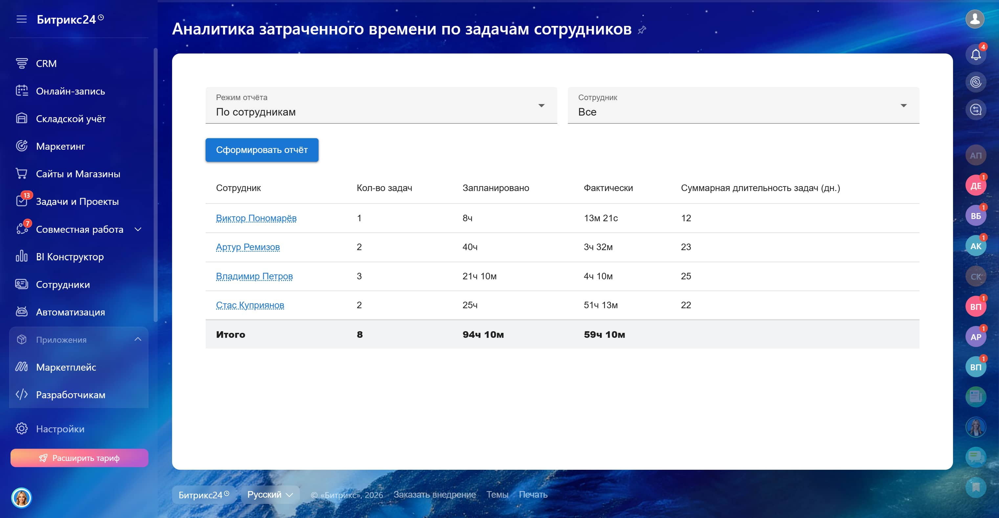
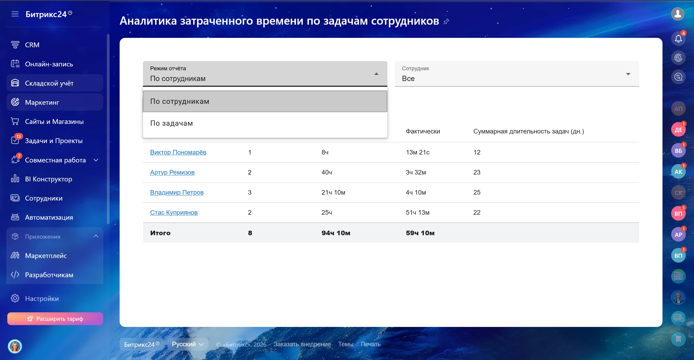
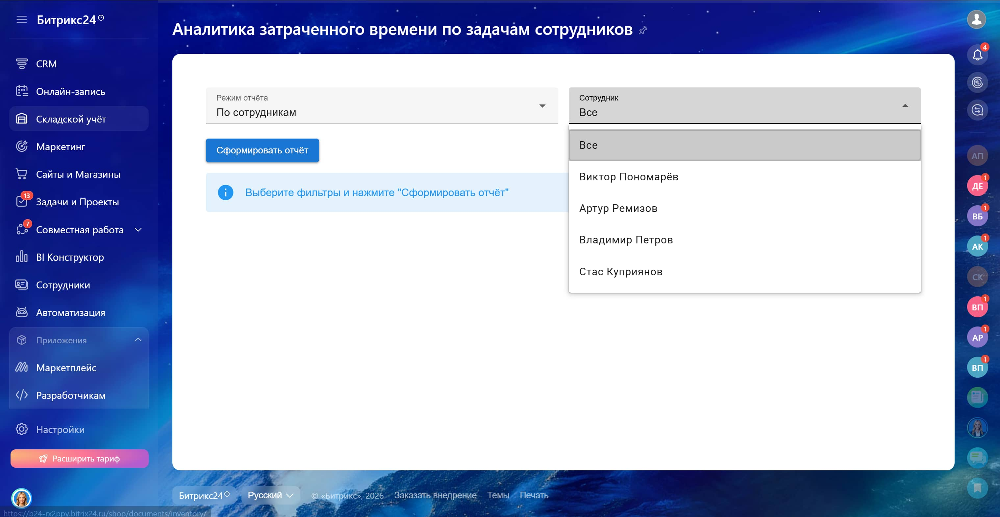
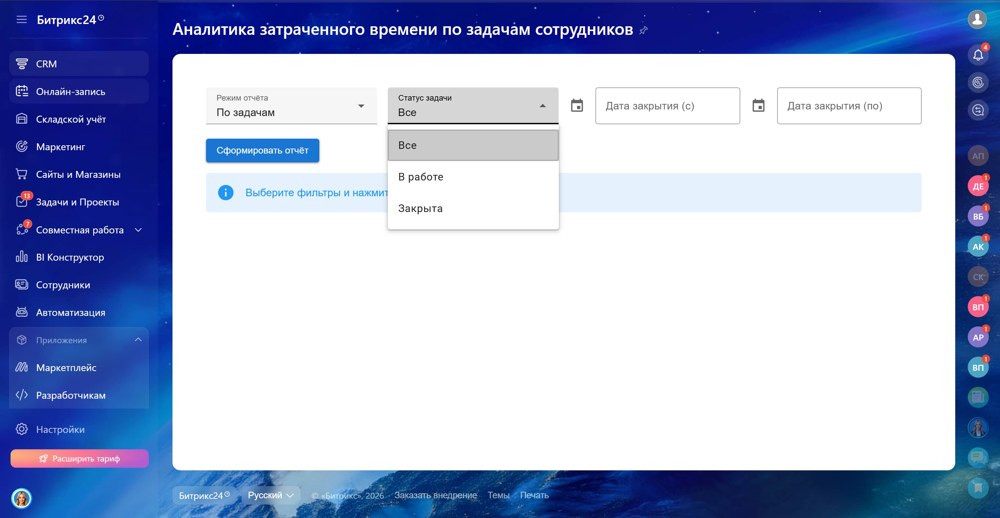
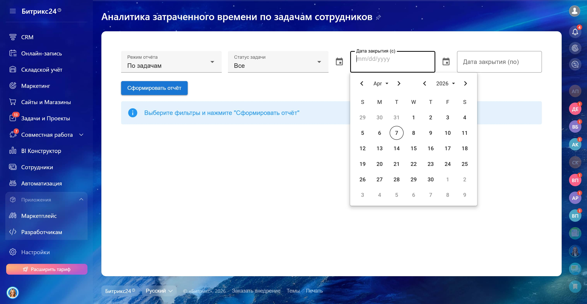
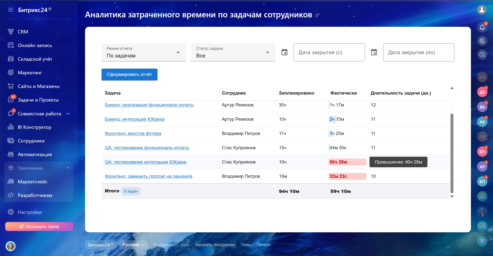

<h1 align="center">Контроль трудозатрат и загрузки команды ⏱️</h1>

Инструмент для автоматизации контроля трудозатрат сотрудников и анализа загрузки команды в <b>Bitrix24</b>. 
Позволяет видеть отклонения от плановых задач и оперативно реагировать на перерасход времени

<b>📊 Мониторинг загрузки • ⏱️ Контроль времени • 🏆 Выявление проблемных задач</b>

<h2>🎥 Демонстрация</h2>

<table width="100%" cellpadding="1" border="1">
<tr align="center">
<td>
 
<em>Работа приложения в реальном времени</em>
</td>
</tr>
</table>

 

<table width="100%">
<tr>
<td align="center">
 
<em>Начальный экран</em>
</td>
<td align="center">
 
<em>Вывод данных</em>
</td>
</tr>

<tr>
<td align="center">
 
<em>Выбор режима просмотра отчёта</em>
</td>
<td align="center">
 
<em>Фильтрация по конкретному сотруднику</em>
</td>
</tr>

<tr>
<td align="center">
 
<em>Фильтрация по статусу задачи</em>
</td>
<td align="center">
 
<em>Фильтрация по датам</em>
</td>
</tr>

<tr>
<td align="center">
 
<em>Индикация перерасхода времени</em>
</td>
</tr>
</table>

<h2>🧩 Контекст задачи</h2>

Клиенту было важно быстро получать прозрачную картину загрузки команды и видеть, где задачи выполняются дольше планируемого.  
Нужно было уметь оперативно выявлять перерасход времени и проблемные зоны, чтобы корректировать план работы сотрудников.

<h2>💡 Что было реализовано</h2>

<ul>
<li>Прозрачный контроль загрузки сотрудников и их трудозатрат</li>
<li>Сравнение плановых и фактических времязатрат</li>
<li>Автоматическое выделение перерасхода и проблемных задач</li>
<li>Отчёты в двух режимах:
  <ul>
    <li><b>По сотруднику</b> – одна строка = один сотрудник</li>
    <li><b>По задаче</b> – одна строка = одна задача</li>
  </ul>
</li>
</ul>

<h2>⚙️ Логика работы</h2>

<ul>
<li>Отчёт можно просматривать в разных режимах — по сотруднику или по задаче</li>
<li>Фильтры по сотруднику, статусу задачи и периоду</li>
<li>Сразу видно перерасход времени и проблемные зоны команды</li>
</ul>

<h2>📊 Метрики отчета</h2>

<table>
<tr>
<th>Показатель</th>
<th>Описание</th>
</tr>
<tr>
<td>Сотрудник</td>
<td>ФИО сотрудника</td>
</tr>
<tr>
<td>Кол-во задач</td>
<td>Количество задач за период</td>
</tr>
<tr>
<td>Запланировано</td>
<td>Запланированное время</td>
</tr>
<tr>
<td>Затрачено</td>
<td>Фактическое время</td>
</tr>
<tr>
<td>Дней на задачу</td>
<td>Срок выполнения</td>
</tr>
</table>

<b>Итоги:</b>

<ul>
<li>Всего времени: Запланировано / Затрачено</li>
<li>Количество задач</li>
</ul>

<h2>🛠 Технологический стек</h2>

<table width="100%" cellpadding="10">
<tr>
<td align="center">
 
<b>Vue.js</b>
</td>
<td align="center">
 
<b>Vuetify</b>
</td>
<td align="center">
 
<b>TypeScript</b>
</td>
<td align="center">
 
<b>Vite</b>
</td>
<td align="center">
 
<b>CSS</b>
</td>

<td align="center">
 
<b>Bitrix24 REST API</b>
</td>
</tr>
</table>

<h2>📩 Контакты</h2>

Telegram: <a href="https://t.me/volodin7ergey">@volodin7ergey</a> 
VK: <a href="https://vk.com/volodin7ergey">vk.com/volodin7ergey</a>

<b>

<b>Готов разработать аналогичные решения под Ваши бизнес-процессы 💼</b>

 </b>

